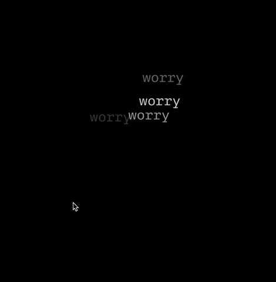

# Connect Class Final Project
* Website is currently live at this address: [http://204.48.19.139:3000/](http://204.48.19.139:3000/)

* Code lives here [in this directory](https://github.com/lynneyun/ConnectClass/tree/main/final)

This final project was definitely a huge learning experience! Something as seemingly simple as retaining information of mouse clicks turned out to be quite more of a challenge than I expected.

In this site, a mouse click will generate 'worry hot spots'. When a mouse hovers near it, it will go 'ahh' and also propel the words forward. This is a sketch that is meant to portray my constant anxious state these days — no worry can quite be forgotten, but when you keep thinking about it, it just makes you more anxious!

The conceptual side of this project was also inspired by the Nature of Code class that I am also taking this semester. Since the mid-term assignment of that class was to create a sketch inspired by particles, I wanted to combine what I had learned with Shawn and create a sketch that 'saves' footprints of people who had been to the site. Hopefully this site captured that sentiment.

Here's an animated GIF of the website sketch:

