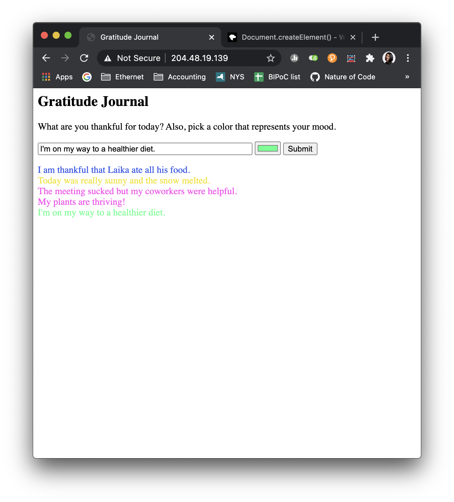

# Connect Class Week 2 homework

* Code lives here [in this directory](https://github.com/lynneyun/ConnectClass/tree/main/week2)

For this week, I created a 'gratitude journal' that could save lines of journal entries. It was a lot harder than I thought to make the server interact with the HTML page and add new divs! I ended up having to create another javascript file to help and had to wade through a lot of Mozilla pages.

Here's the result:

