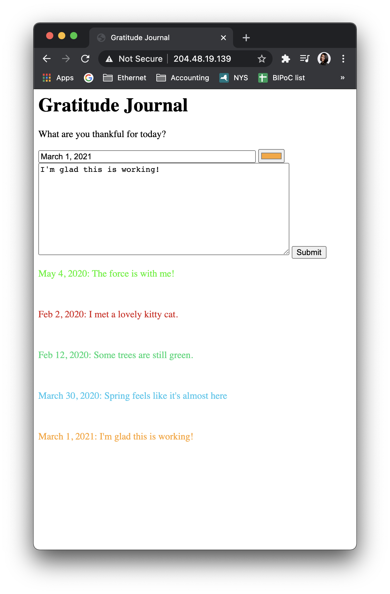

# Connect Class Week 3 homework

* Code lives here [in this directory](https://github.com/lynneyun/ConnectClass/tree/main/week3)

I'm still not TOO sure about what I'm doing, but I think I'm starting to wrap my head around it a bit more looking at this week's tutorials. I think I need a better 'mental model' of what my code is doing — I'm still spending a lot of time tweaking a piece of code, uploading it on Fetch, and then seeing what has changed.

This week, I updated my 'gratitude journal' from last week. It saves multiple entries, and you can open each entry and search them as well.

Here's a screenshot of the results:

